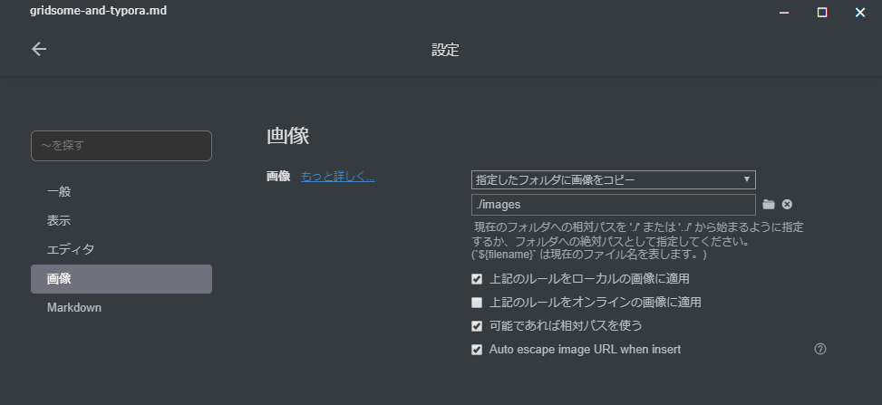
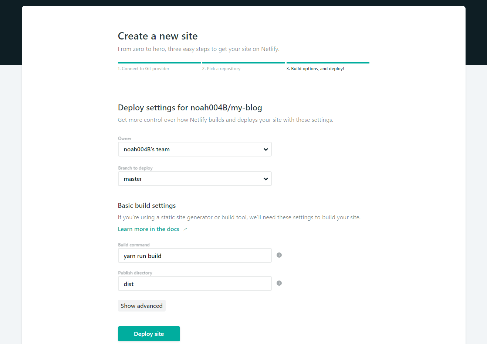

## はじめに

簡単な内容を目立たずひっそり公開する場所として、久しぶりにブログを作ってみることにしました。Vuejsを触りたいこともあり、Gridsome、Typora、Netlifyを使いました。記事の更新の流れや、セットアップの方法について書いています。

## 使ったもの

### Gridsome

Vuejsをベースにした静的サイトジェネレータ。CMSからGraphQLで取得したコンテンツから静的サイトを生成するツールなのだけど、今回はできるだけシンプルにするためにローカルでMarkdownファイルを書く方式にしました。

https://gridsome.org/

### Typora

マルチプラットフォームで動作するMarkdown Editor。画像をコピペできたり、YAMLのFront Matterに対応していたり、いい感じ。

https://typora.io/

### Netfly

ビルド・デプロイをして、サイトとして公開するところまでやってくれる。無料。いい。

https://www.netlify.com/

## 更新の流れ


1. Typoraでマークダウンで記事を書く
2. gridsomeをローカルで動かして、ページの仕上がりを確認
3. 問題なければgitでプッシュする
4. Netlifyが自動でビルドしてサイトをデプロイしてくれる

## セットアップ

### Gridsomeのセットアップ

Gridsomeをインストール。

```bash
$ yarn global add @gridsome/cli
```

Gridsomeでサイトの雛形を生成します。

```bash
$ gridsome create name-of-the-blog https://github.com/gridsome/gridsome-starter-blog.git
```

開発用のサーバを起動。

```
$ cd deveops-never-die
$ gridsome develop
```

ブラウザで `localhost:8080` にアクセス。

Authorとか、サイトの説明をいい感じに修正します。

```
$ vim src/components/Author.vue
$ vim gridsome.config.js
```

### Typoraのセットアップ

設定 > 画像の画面で、「指定したフォルダに画像をコピー」と「./images」を指定。




この設定をすることで、デスクトップの画像をドラッグ・アンド・ドロップしたりクリップボードの画像を貼り付けると、自動的に `./images` フォルダに画像ファイルがコピーされ、エディタに画像が表示されます。とてもいい感じ。

ただし、クリップボードから貼り付けると画像ファイルが `1565278306843.png` のような名前になるので、後から整理しようとすると苦労しそう。

### Typoraで最初の記事を書く

`./content/posts`ディレクトリに.mdファイルを作ります。画像は`./content/posts/images`に格納します。記事を書いたらGithubにプッシュしましょう。


エディタは編集とプレビュー画面が一体化した方式。2ペインのエディタよりもスッキリしています。TyporaはFront matterに対応しているところがとてもよいですね。新しいファイルの先頭で `---` を入力して `Enter`  キーを押すとメタデータのエリアができます。

https://support.typora.io/Markdown-Reference/#yaml-front-matter

### Netflyのセットアップ

Netflyに登録して、「New site from Git」から新しいサイトを登録します。注意点はビルドコマンドくらい。「Deploy site」をクリックすると自動でビルドされて、サイトが公開されます。



完成！