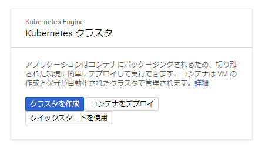
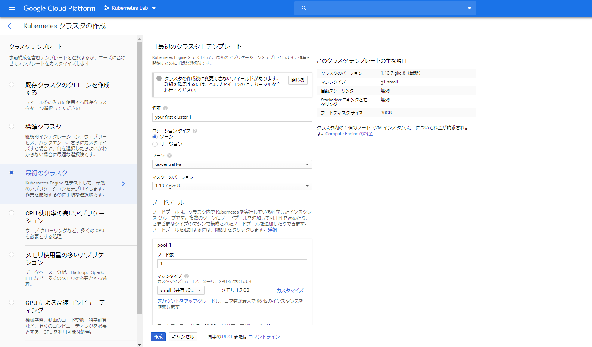
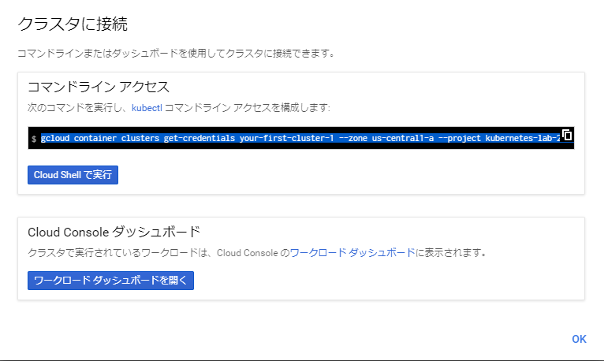

## はじめに

この記事では、GKEを使ったKubernetesの検証環境の作り方手順と、コンテナの基本操作を書いています。

## 事前準備

作業するにgcloudコマンドをインストールしておきましょう。
→https://cloud.google.com/sdk/docs/quickstarts

## クラスタの作り方

### プロジェクトの作成
後でまるごと削除できるので、専用のプロジェクトを作成しておくのがよさそう。画面のヘッダーから作成できます。

### クラスタの作成

ナビゲーションメニューから「Kuberenetes Engine」を選んで、「クラスタを作成」をクリック。



### クラスタ テンプレートの選択と設定

左側のクラスタテンプレートで用途にあったテンプレートを選択します。今回は検証なので一番小さい「最初のクラスタ」テンプレートを使います。バージョンもゾーン（US）もデフォルトのまま、「作成」ボタンをクリック。




このときはだいたい3～4分くらいでクラスタができました。早い。

### Kubectlからアクセスできるようにする

作成したクラスタの「接続」ボタンをクリックして、表示されるコマンドを実行します。




```
$ gcloud container clusters get-credentials your-first-cluster-1 --zone us-central1-a --project kubernetes-lab-xxxxxxx
```

### Kubectlの向き先のクラスタを確認

設定済みのクラスタとは別に新規で今回作成したクラスタが追加されていることが確認できます。クラスタの名前が長い。

```
$ kubectl config get-contexts
CURRENT   NAME                                                           CLUSTER                                                        AUTHINFO                                                       NAMESPACE
*         gke_kubernetes-lab-xxxxx_us-central1-a_your-first-cluster-1   gke_kubernetes-lab-xxxxx_us-central1-a_your-first-cluster-1   gke_kubernetes-lab-xxxxx_us-central1-a_your-first-cluster-1
          kubernetes-admin@kubernetes                                    kubernetes                                                     kubernetes-admin                                               elasticsearch
```

### kubectlの動作確認

```
$ kubectl get nodes
NAME                                            STATUS   ROLES    AGE   VERSION
gke-your-first-cluster-1-pool-1-xxxxxxxx-xxxx   Ready    <none>   54m   v1.13.7-gke.8
```

いい感じ

## 試しにコンテナをデプロイする

### マニフェストの作成

作業マシン上でpostgres-deployment.yaml作成。

```
apiVersion: apps/v1
kind: Deployment
metadata:
  name: postgres-deployment
  labels:
    app: postgres
spec:
  replicas: 3
  selector:
    matchLabels:
      app: postgres
  template:
    metadata:
      labels:
        app: postgres
    spec:
      containers:
      - name: postgres
        image: postgres:9.4
        ports:
        - containerPort: 5432
```

### クラスタ上にコンテナをデプロイ。

```
$ kubectl apply -f postgres-deployment.yaml
```

### Podの状態を確認

Pod 3つもいらなかった。ミスりました。

```
$ kubectl get pods
NAME                                   READY   STATUS    RESTARTS   AGE
postgres-deployment-7f896476bb-7h56v   1/1     Running   0          4m24s
postgres-deployment-7f896476bb-9c9w7   1/1     Running   0          4m24s
postgres-deployment-7f896476bb-lhkkb   1/1     Running   0          4m24s
```

### コンテナのログを確認

-fでログがリアルタイムでtail -f的にストリームされます。

```
$ kubectl logs -f postgres-deployment-7f896476bb-7h56v
```

### コンテナへログイン

kubectlコマンドからできる。とてもいい感じ。

```
$ kubectl exec -it postgres-deployment-7f896476bb-7h56v bash
$ root@postgres-deployment-7f896476bb-7h56v:/#
```