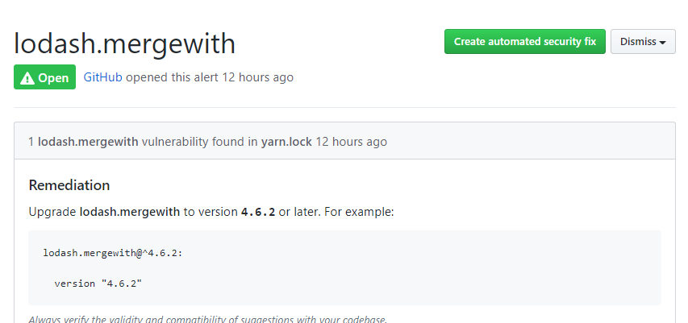
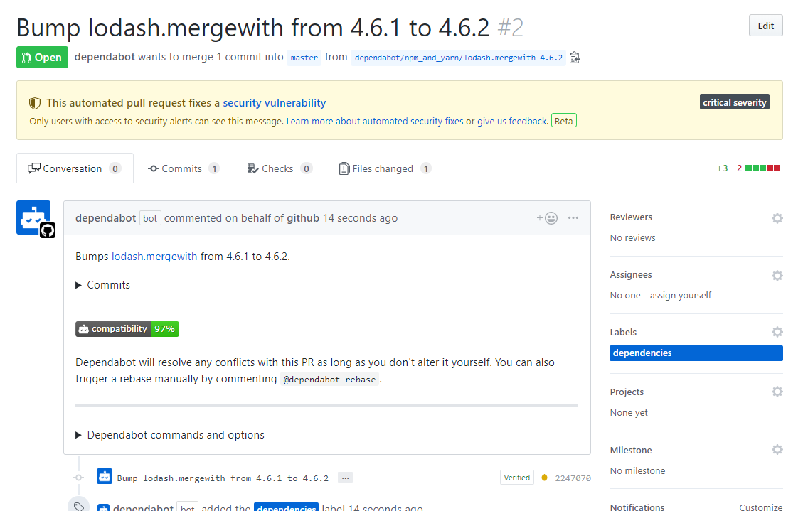
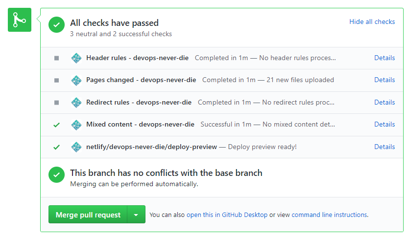

Githubから以下のVlunerablility Alertが来ました。これをGithubの機能でサクッと解決する方法と、yarnコマンド使って手動で解決する方法を残しておきます。

## GithubのAutomated Security Fixの機能を使う

Vunnerablityの画面の「Create automated security fix」ボタンをクリックします。



少しすると自動的にこの問題を解決するPull requestが作成されます。



ちょっとビックリしたのが、Netlifyと連携する設定をしているせいか、自動でテストが行われるところ。



Merge pull requestをクリックするだけ。これなら手作業でやらないで任せてしまってもよさそう。すごい。

## 手動でパッケージをアップグレードするなら

```
$ yarn upgrade lodash@^4.17.13
```

https://yarnpkg.com/lang/ja/docs/cli/upgrade/