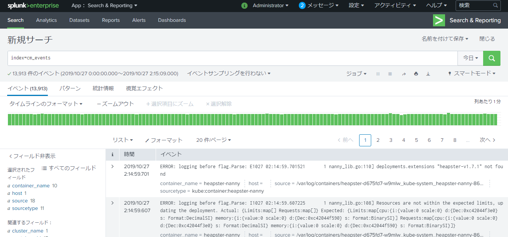

## 

Kubernetes上にSplunkをデプロイ

KubernetesのログでSplunkに転送するところまでを試しました。手順はほぼSplunk公式の[
Deploy Splunk Enterprise on Kubernetes: Splunk Connect for Kubernetes and Splunk Insights for Containers (BETA) - Part 3)]( https://www.splunk.com/blog/2019/03/01/deploy-splunk-enterprise-on-kubernetes-splunk-connect-for-kubernetes-and-splunk-insights-for-containers-beta-part-3.html )の通りですが、うまくいかないところがいくつかあったので、試した結果うまく行った方法をまとめました。

## Kubernetes上にSplunkをデプロイ

以下のマニフェストを作成します。Splunkのadminユーザのパスワードは適宜変更します。

splunk-deployment.yaml

```yaml
apiVersion: apps/v1
kind: Deployment
metadata:
  name: splunk
  labels:
    app: splunk
spec:
  replicas: 1
  selector:
    matchLabels:
      app: splunk
  template:
    metadata:
      labels:
        app: splunk
    spec:
      containers:
      - name: splunk
        image: splunk/splunk:8.0.0
        ports:
        - containerPort: 8000
        - containerPort: 8088
        env:
        - name: SPLUNK_START_ARGS
          value: '--accept-license'
        - name: SPLUNK_PASSWORD
          value: '<your-password>
```

splunk-service.yaml

```yaml
apiVersion: v1
kind: Service
metadata:
  name: splunk
spec:
  type: NodePort
  selector:
    app: splunk
  ports:
    - name: web
      protocol: TCP
      port: 8000
      targetPort: 8000
    - name: data
      protocol: TCP
      port: 8088
      targetPort: 8088
```

マニフェストを環境に適用。

```bash
$ kubectl -n splunk apply -f splunk-deployment.yaml
$ kubectl -n splunk apply -f splunk-service.yaml
```

今回の環境ではIngressをせずに、NodePortのServiceを直接外部に公開することにしました。GKEを使用していたため、GCPのポートを開放します。

まずはNodePortを確認します。

```bash
$ kubectl -n splunk get services
```

GCPのポートを開放します。

```bash
$ gcloud compute firewall-rules create redis-node-port --allow tcp:30431
```

あとは、http://[KubernetesノードのIP]:[NodePortのポート] にブラウでアクセスできるはず。

KubernetesのノードのIPは以下のコマンドの「EXTERNAL-IP」で確認できます。

```bash
$ kubectl get nodes --output wide
```


初期ユーザはadmin、パスワードはマニフェストで指定したものでログインできます。

## Splunkのインデックス作成

ブラウザでSplunkにログインして、設定＞インデックス＞新規インデックスを開き、以下の2つのインデックスを作成します。

```
インデックス名：cm_events
インデックスデータ・タイプ：イベント
```

```
インデックス名：cm_meta
インデックスデータ・タイプ：イベント
```

```
インデックス名：cm_metrics
インデックスデータ・タイプ：メトリック
```

## SplunkのHEC設定

設定＞データ入力＞HTTP Event Collector＞グローバル設定を開き、以下を設定します。

```
全トークン：有効
SSLを有効にする：オフ
```

同じ画面で新規トークンから、以下の内容でトークンを追加します。

```
名前：kubernetes-token
許可されたインデックスを選択：cm_events, cm_meta, cm_metircs
```

作成したトークンは、後述のHelm installで使用するvalue.yamlの中に記述します。

## HECの動作確認

HTTPリクエストでデータ投入が可能か、curlコマンドを実行して確認します。IP, Port, トークンは環境に合わせて置き換えて実行します。

```bash
curl -k "http://<node-ip>:<nodePort>/services/collector" -H "Authorization: Splunk xxxxxxxx-xxxx-xxxx-xxxx-xxxxxxxxxxxx" -d '{ "time": 1545316835, "host": "search-5944fc8696-5n7l4", "index": "cm_events", "source": "hec-test", "event": { "message": "Something happened", "severity": "INFO"}}'
```

画面上でデータを確認します。出てくればOK。サーチクエリの例：

```
source="hec-test"　index=cm_events 
```


## splunk-connectのデプロイ

Tiller用のRBACの設定を作成します。

 tiller-rbac-config.yaml 

```yaml
# https://docs.helm.sh/using_helm/#example-service-account-with-cluster-admin-role
apiVersion: v1
kind: ServiceAccount
metadata:
  name: tiller
  namespace: splunk
---
apiVersion: rbac.authorization.k8s.io/v1beta1
kind: ClusterRoleBinding
metadata:
  name: tiller
  namespace: splunk
roleRef:
  apiGroup: rbac.authorization.k8s.io
  kind: ClusterRole
  name: cluster-admin
subjects:
  - kind: ServiceAccount
    name: tiller
    namespace: splunk
```

上記の設定をKubernetesに適用します。

```bash
$ kubectl -n splunk apply -f tiller-rbac-config.yaml
```

下記のhelm initを実行。

```bash
$ helm init --service-account tiller --tiller-namespace splunk
```

Tillerのpodが稼働していることを確認します。

```bash
$ kubectl -n splunk get pods
```

Helm installで渡すvalues.yamlを作成します。tokenの値は、HECの設定の際に作成したものをセットします。

values.yaml

```yaml
#global settings
global:
  logLevel: info 
  splunk:
    hec:
      protocol: http
      insecureSSL: true
      host: splunk
      token: <xxxxxxxx-xxxx-xxxx-xxxx-xxxxxxxxxxxx>

#local config for logging chart
splunk-kubernetes-logging:
  journalLogPath: /run/log/journal
  splunk:
    hec:
      indexName: cm_events 

#local config for objects chart      
splunk-kubernetes-objects:
  rbac:
    create: true
  serviceAccount:
    create: true
    name: splunk-kubernetes-objects
  kubernetes:
    insecureSSL: true
  objects:
    core:
      v1:
        - name: pods
          interval: 30s
        - name: namespaces
          interval: 30s
        - name: nodes
          interval: 30s
        - name: services
          interval: 30s
        - name: config_maps
          interval: 30s
        - name: persistent_volumes
          interval: 30s
        - name: service_accounts
          interval: 30s
        - name: persistent_volume_claims
          interval: 30s
        - name: resource_quotas
          interval: 30s
        - name: component_statuses
          interval: 30s
        - name: events
          mode: watch
    apps:
      v1:
        - name: deployments
          interval: 30s
        - name: daemon_sets
          interval: 30s
        - name: replica_sets
          interval: 30s
        - name: stateful_sets
          interval: 30s
  splunk:
    hec:
      indexName: cm_meta    
          
#local config for metrics chart
splunk-kubernetes-metrics:
  rbac:
    create: true
  serviceAccount:
    create: true
    name: splunk-kubernetes-metrics
  splunk:
    hec:
      indexName: cm_metrics
```

splunk-connectをデプロイ。

```bash
$ helm install --name splunk-connect --tiller-namespace splunk --namespace splunk -f values.yaml https://github.com/splunk/splunk-connect-for-kubernetes/releases/download/1.2.0/splunk-connect-for-kubernetes-1.2.0.tgz
```

動作確認

```bash
$ kubectl -n splunk get pods
```

各Podのログにエラーがないことを確認します。

```bash
$ kubectl -n splunk logs <pod-name>
```

## Splunkに投入されたデータの確認

Search & Reporting APPを開き、以下の条件でサーチを実行します。何らかの結果が出てくればOKです。



---

参考

[Deploy Splunk Enterprise on Kubernetes: Splunk Connect for Kubernetes and Splunk Insights for Containers (BETA) - Part 3]( https://www.splunk.com/blog/2019/03/01/deploy-splunk-enterprise-on-kubernetes-splunk-connect-for-kubernetes-and-splunk-insights-for-containers-beta-part-3.html )

[Qiita - SplunkでKubernetesのログとメトリクスを監視してみよう]( https://qiita.com/kikeyama/items/447c7126a5c454a558f0 )

